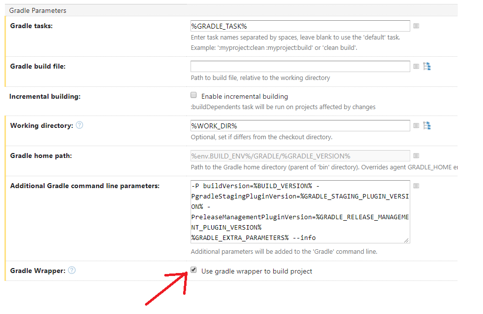

:header: Octopus Release Management Gradle plugin
= {header}
Gradle
v: New hope
:toc:
:toclevels: 4
:version-label: 1.0-SNAPSHOT
:impl-logging-core:

== Introduction

 org.octopusden.octopus-release-management gradle plugin is intended for supporting and Continuous integration.

The actual org.octopusden.octopus-release-management gradle plugin version is v{version-label}

== Terminology

This guide uses term Staging introduced in Nexus which is equivalent to DEV used in Artifactory.

Staging (DEV) means publishing artifacts in development repository that is not in release state. It could be used for testing and been promoted to release state that means ready to use in Production.

== Recommended versions

Recommended Gradle versions to use are 6.X and 7.X

.Support status
|===
|Gradle version|Status

|7.X
|Full support

|6.X
|Full support

|5.X
|Not supported

|4.10.X
|Partial supported

|4.10 and before
|Not supported
|===

Gradle versions before 4.10 are not supported because of JFrog plugin requirements.

== How to setup development environment

Modern version of Gradle(6.X and later) should be installed manually. Please follow instruction from https://gradle.org/install/#manually[official gradle guide].

Adjust init.gradle and gradle.properties if you need access to corporate Nexus/Artifactory
+
.gradle.properties
----
NEXUS_USER=<your domain username>
NEXUS_PASSWORD=<your domain password>
----

== Configuring project

The project should be configured to use https://docs.gradle.org/current/userguide/gradle_wrapper.html[gradle wrapper]

=== Use DEV/Staging repository

This can be only needed if you want to use not yet released dependencies (i.e. from staging/dev repository)

Access to DEV/Staging repository deployed artifacts could be done in few ways:

. Use staging() method in Groovy based build project repositories DSL (Kotlin DSL is not supported).
+
.script block:
[source,groovy]
----
repositories {
    staging()
}
----
+
.buildscript block:
[source,groovy]
----
buildscript {
    repositories {
        staging()
    }
}
----
. Specify use_dev_repository project's property
+
----
use_dev_repository=all|plugins|buildscript|dependencies
----
+
The property accepts command separated values (one or more)
The configuration could be done:
+
.. In gradle.properties
+
----
use_dev_repository=plugins
----
.. Via command line -P parameter
+
----
gradle -Puse_dev_repository=plugins,dependencies ...
----
.. https://docs.gradle.org/current/userguide/build_environment.html#sec:project_properties[Via environment variable]
+
----
export ORG_GRADLE_PROJECT_use_dev_repository=all
----

. Manually configured repository *(NOT RECOMMENDED)*

.. Plugin management (settings.gradle)
+
[source,groovy,subs="attributes"]
----
pluginManagement {
    repositories {
        maven {
            credentials {
                username = settings['NEXUS_USER']
                password = settings['NEXUS_PASSWORD']
            }
            url '{repository-url}'
            metadataSources {
                mavenPom()
                artifact()
            }
        }
   }
}
----
.. Repositories groovy buildscript DSL
+
[source,groovy,subs="attributes"]
----
buildscript {
    repositories {
        maven {
            credentials {
                username = NEXUS_USER
                password = NEXUS_PASSWORD
            }
            url '{repository-url}'
            metadataSources {
                mavenPom()
                artifact()
            }
        }
    }
}
----
.. Dependencies groovy repository DSL
+
[source,groovy,subs="attributes"]
----
repositories {
    maven {
        credentials {
            username = NEXUS_USER
            password = NEXUS_PASSWORD
        }
        url '{repository-url}'
        metadataSources {
            mavenPom()
            artifact()
        }
    }
}
----
+
*Why this is not recommended*: The repository name or authentication schema or parameter names could be changed in any time which results in project build failure

=== Gradle wrapper

To configure project to use https://docs.gradle.org/current/userguide/gradle_wrapper.html[gradle wrapper] or to update gradle wrapper run in project directory
----
gradle wrapper
----
The added files gradlew, _gradlew.bat  and added directory gradle/wrapper content should be added to VCS

The gradle build step on TeamCity build configuration has to be configured to use gradle wrapper as follows:

=== Use Octopus Release Management gradle plugin

==== The plugins DSL

To support and Continues integration the project has to be configured to use org.octopusden.octopus-release-management plugin.

[source,groovy]
----
plugins {
    id 'org.octopusden.octopus-release-management'
}
----

No need more. The staging plugin will by applied by plugin and project will be configured.

==== Legacy Plugin Application

Applying the org.octopusden.octopus-release-management plugin with the buildscript block:

:markup-in-source: verbatim,quotes

[source,groovy,subs="attributes"]
----
buildscript {
    dependencies {
         classpath "org.octopusden.octopus-release-management:org.octopusden.octopus-release-management:${project.findProperty('octopus-release-management.version') ?: '{version-label}'}"
     }
}

apply plugin: 'org.octopusden.octopus-release-management'
----

=== The OW Release Management gradle plugin version

The recommended way to configure _org.octopusden.octopus-release-management_ plugin version is to use plugins DSL and project properties placed in gradle.properties

This method will require timeFor that need to configure plugin management in project _settings_ file:

.settings.gradle
[source,groovy]
----
pluginManagement {
    plugins {
        id 'org.octopusden.octopus-release-management' version settings['octopus-release-management.version']
    }
}
----

.settings.gradle.kts
[source,kotlin]
----
pluginManagement {
    plugins {
        id("org.octopusden.octopus-release-management") version(extra["octopus-release-management.version"] as String)
    }
}
----

and put property _octopus-release-management.version_ with version in the project _gradle.properties_

[subs="attributes"]
----
octopus-release-management.version={version-label}
----

=== TeamCity compile and continues delivery build configuration

This section is described how to configure Gradle based project to build on TeamCity.

The user build customization (specify additional parameters, options and etc) has to be done by modifying build configuration parameter GRADLE_EXTRA_PARAMETERS

.Do not specify build customization in below steps:
. Gradle tasks
. Additional Gradle command line parameters
. JVM command line parameters

.To customize above parameters use build configuration parameters:
. GRADLE_TASK
. GRADLE_EXTRA_PARAMETERS
. JAVA_OPTS

=== Publishing artifacts

To publish artifacts need to apply _org.octopusden.octopus-release-management_ and maven-publish plugins and configure publishing extension.

No repository configuration is needed anymore.

.For example
[source,groovy]
----
plugins {
    id 'org.octopusden.octopus-release-management'
    id 'java-library'
}

java {
    withJavadocJar()
    withSourcesJar()
}

apply plugin: 'maven-publish'

publishing {
    publications {
        mavenJava(MavenPublication) {
            from components.java
        }
    }
}
----

.For gradle prior 6 sometimes need to declare maven repository in publishing section
[source,groovy]
----
publishing {
    publications {
        mavenJava(MavenPublication) {
            from components.java
        }
    }
}
----

==== Specify dependencies for published artifacts

https://docs.gradle.org/current/dsl/org.gradle.api.publish.maven.MavenPom.html[Official Gradle guide] to customize publishing pom.xml

To specify dependencies from declared configurations apply _'org.octopusden.octopus-release-management'_ plugin and use *declareDependencies* method:

[source,groovy]
----
plugins {
    id 'org.octopusden.octopus-release-management'
}
configurations {
    fc_spartak
}

dependencies {
    fc_spartak 'org.apache.logging.log4j:log4j-core:2.14.1'
}
publishing {
    publications {
        maven(MavenPublication) {
            artifact (<...>) {
                pom {
                    declareDependencies(configurations.fc_spartak)
                }
            }
        }
    }
}
----

To declare from several configurations
[source,groovy]
----
plugins {
    id 'org.octopusden.octopus-release-management'
}
configurations {
    fc_spartak
    fc_zenit
}

publishing {
    publications {
        maven(MavenPublication) {
            artifact (<...>) {
                pom {
                    declareDependencies([configurations.fc_spartak, configurations.fc_zenit])
                }
            }
        }
    }
}
----

==== Publish to Releases repository

To publish to Releases repository need to specify Gradle project's parameter _publishToReleaseRepository_ to true

.gradle.properties
----
publishToReleaseRepository=true
----

==== Publish aggregation build

To publish aggregation build the project has to be configured to publish artifacts from configurations.

The artifacts' configurations has to be specified in project properties.

.gradle.properties
----
com.jfrog.artifactory.publishConfigs=<project configurations>
----

Each publish has to use unique build name specified via _buildInfo.build.name_ parameter:

----
-PbuildInfo.build.name=%UNIQUE_ARTIFACTORY_BUILD_NAME%
----

On release step each published build has to be promoted.

For more details please google for "Artifactory aggregation build publishing" and "Configure to skip publish pom"

Short brief:

Aggregation build is a build executed several times. For example: platform dependent libs build, for example Linux and Windows. That build is executed twice on Windows and Linux agents to build and publish artifacts.

Configure project to publish aggregation build:

Declare _builds_ configuration's artifacts to be published:

.gradle.properties
----
com.jfrog.artifactory.publishConfigs=builds
----

Configure artifacts to publish:

.build.gradle
[source,groovy]
----
plugins {
    id 'org.octopusden.octopus-release-management'
    id 'maven-publish'
}

configurations {
    builds
}

def libArtifact = artifacts.add('builds', file('gradle.properties')) {
    name project.name
    type 'properties'
    extension 'properties'
    classifier CLASSIFIER
}

publishing {
    publications {
        main(MavenPublication) {
            artifact libArtifact
        }
    }
}
----

Use project parameter _CLASSIFIER_ to specify platform build:

----
gradlew -PCLASSIFIER=win publish
gradlew -PCLASSIFIER=nix publish
----

=== Restrictions of use Release management gradle plugin

. Should be used with gradle 6 and next
. The _io.spring.dependency-management_ is not supported in the legacy projects. Use platform dependency management instead of

.For example, depends on spring boot
[source,groovy]
----
plugins {
    id 'org.springframework.boot'
}
dependencies {
    implementation platform("org.springframework.boot:spring-boot-dependencies:${project['spring-boot.version']}")
    implementation 'org.springframework.boot:spring-boot-starter-web'
}
----

.Example depends on JUnit5
[source,groovy]
----
dependencies {
    testCompile  enforcedPlatform("org.junit:junit-bom:${project.'junit-jupiter.version'}")
    testCompile "org.junit.jupiter:junit-jupiter-engine"
}
test {
    useJUnitPlatform()
}
----

=== Known issues

. NPE on publish
+
Check that parallel task execution is disabled. Parallel execution results in wrong task order execution (a publish task is executed before openStagingRepository).

. Unable to publish artifact
+
If TeamCity project build configuration is not based on standard templates and is used gradle 6 and next then the publishing artifact may fail due to the https://issues.sonatype.org/browse/MVNCENTRAL-5276[Bug: Validation should support SHA256 and SHA512 checksums]
.To bypass problem need to specify below parameter to the gradle runner
----
-Dorg.gradle.internal.publish.checksums.insecure=true
----

=== Complete example

.gradle.properties
[subs="attributes"]
----
octopus-release-management.version={version-label}
kotlin.version=1.3.70
spring-boot.version=2.2.5.RELEASE
platform-utils.version=1.2.687
----

.settings.gradle
[source,groovy]
----
pluginManagement {
    plugins {
        id 'org.octopusden.octopus-release-management' version settings['octopus-release-management.version']
        id 'org.jetbrains.kotlin.jvm'            version settings['kotlin.version']
        id 'org.springframework.boot'            version settings['spring-boot.version']
    }
}
----

.build.gradle
[source,groovy,subs="attributes+"]
----
plugins {
    id 'org.octopusden.octopus-release-management'
    id 'java-library'
    id 'org.springframework.boot'
    id 'org.jetbrains.kotlin.jvm'
}

dependencies {
    implementation platform("org.springframework.boot:spring-boot-dependencies:${project['spring-boot.version']}")
    annotationProcessor 'org.springframework.boot:spring-boot-configuration-processor'
    implementation 'org.springframework.boot:spring-boot-starter-web'
    implementation 'org.springframework.boot:spring-boot-starter-security'
    implementation 'org.springframework.security:spring-security-oauth2-jose'
    implementation 'org.springframework.security:spring-security-oauth2-client'
    implementation "org.jetbrains.kotlin:kotlin-stdlib-jdk8"
    {impl-logging-core}
}

jar {
    enabled = true
}

bootJar {
    enabled = false
}

java {
    withJavadocJar()
    withSourcesJar()
}

apply plugin: 'maven-publish'

publishing {
    publications {
        mavenJava(MavenPublication) {
            from components.java
        }
    }
}
----

== Supporting Gradle prior 6

== Register dependencies for RM 2.0

The _'org.octopusden.octopus-release-management'_ Gradle plugin includes all required functionality

No additional plugin applying is needed.

Dependency registration performs automatically when property '-PincludeAllDependencies' is set. Release management gradle plugin adds all dependencies which are included to distribution and filtered by groups used in the Company. To add extra dependencies the section releaseDependencies of the releaseManagement extension has to be configured:

.E.g.
[source,groovy]
----
plugins {
    id 'org.octopusden.octopus-release-management'
}

releaseManagement {
    releaseDependencies {
        component name: "deployer", version: project.'deployer.version'
        component name: "deployerDSL", version: project.'deployer.dsl.version'
    }
}
----

.Supported formats:
* component name: "componentName", version: "1.0"
* component "componentName:version"

== Generate SBOM

The _'org.octopusden.octopus-release-management'_ Gradle plugin is able to create an aggregate of all direct and transitive dependencies of a project and generate a valid CycloneDX SBOM. CycloneDX is a lightweight software bill of materials (SBOM) specification designed for use in application security contexts and supply chain component analysis. For enable generation provide '-Pcyclonedx.skip=false'. File will appear in 'build/generated-resources/sbom' directory.

== Use docker

Supported from 1.0.255

Supported platforms: Windows, RHEL 7/8

=== Execute command in docker container

Use _com.platformlib.plugins.gradle.wrapper.task.DockerTask_ task to execute command in docker container.

.E.g. execution command in docker container
[source,groovy]
----
plugins {
    id 'org.octopusden.octopus-release-management'
}

task buildGoApplication(type: com.platformlib.plugins.gradle.wrapper.task.DockerTask) {
    outputs.file("$buildDir/go-out/go-app")
    image = 'golang:1.17.0-alpine3.14'
    workDir = '/src'
    dockerOptions = ['--network', 'host']
    bindMounts = ["${file('src/main/go')}:/src", "$buildDir/go-out:/out", "$buildDir/go-cache:/.cache"]
    commandAndArguments = ['go', 'build', '-o', '/out/go-app']
}
----

If there are several tasks use the same configuration then it could be configured via _platformDockerWrapper_ extension.

.E.g. execution few commands in docker container, re-use go-cache between executions
[source,groovy,subs="attributes"]
----
plugins {
  id 'org.octopusden.octopus-release-management'
}

ext {
  repository = "git.domain.corp/system/test-agent"
}

platformDockerWrapper {
    image = '{docker-registry}/platform/go-build:1.1.7'
    workDir = '/buildDir'
    dockerOptions = ['--network', 'host']
    bindMounts = ["$rootDir:/project/src/${repository}.git", "$buildDir:/buildDir", "$buildDir/deps/:/deps", "$buildDir/go-cache:/.cache"]
    env = ["GOPATH": "/go:/deps:/project"]
    commandAndArguments = ['go', 'build', "-ldflags=-s -w -X git.domain.corp/system/golib.git/srv.Version=${project.version}"]
}

task buildLinuxGoApplication(type: com.platformlib.plugins.gradle.wrapper.task.DockerTask, dependsOn: unpackDependencies) {
    outputs.file("$buildDir/test-agent")
    commandAndArguments += ['-o', 'test-agent', "${repository}.git/cmd/test-agent"]
}

task buildWinGoApplication(type: com.platformlib.plugins.gradle.wrapper.task.DockerTask, dependsOn: unpackDependencies) {
    outputs.file("$buildDir/test-agent.exe")
    env += ['GOARCH': 'amd64', 'GOOS': 'windows', 'CXX': 'x86_64-w64-mingw32-g++', 'CC': 'x86_64-w64-mingw32-gcc', 'CGO_ENABLED': '1']
    commandAndArguments += ['-o', 'test-agent.exe', "${repository}.git/cmd/test-agent"]
}
----

The task outputs' could be used as source for artifact publishing

.Full limited example:
[source,groovy,subs="attributes"]
----
plugins {
  id 'base'
  id 'maven-publish'
  id 'org.octopusden.octopus-release-management'
}

ext {
  repository = "git.domain.corp/system/test-agent"
}

platformDockerWrapper {
    image = '{docker-registry}/platform/go-build:1.1.7'
    workDir = '/buildDir'
    dockerOptions = ['--network', 'host']
    bindMounts = ["$rootDir:/project/src/${repository}.git", "$buildDir:/buildDir", "$buildDir/deps/:/deps", "$buildDir/go-cache:/.cache"]
    env = ["GOPATH": "/go:/deps:/project"]
    commandAndArguments = ['go', 'build', "-ldflags=-s -w -X git.domain.corp/system/golib.git/srv.Version=${project.version}"]
}

group = "org.octopusden.test"

configurations {
  go_compile
}

dependencies {
  go_compile "{golang-commons}"
}

// Short version of the task (it doesn't do what it should do)
task unpackDependencies(type: Copy) {
  from zipTree(configurations.go_compile.singlefile)
  into "$buildDir/deps/src"
}

task buildLinuxGoApplication(type: com.platformlib.plugins.gradle.wrapper.task.DockerTask, dependsOn: unpackDependencies) {
    outputs.file("$buildDir/test-agent")
    commandAndArguments += ['-o', 'test-agent', "${repository}.git/cmd/test-agent"]
}

task linuxZip(type: Zip, dependsOn: buildLinuxGoApplication) {
  archiveName = "test-agent-linux.zip"
  destinationDir = file(buildDir)
  from(buildLinuxGoApplication) {
    fileMode 0755
  }
}

publishing {
  publications {
    maven(MavenPublication) {
      artifact(linuxZip) {
        classifier "linux"
        extension "zip"
      }
    }
  }
}

assemble {
  dependsOn = [linuxZip]
}
----

=== Use docker directly or via tasks/plugins

If project uses docker directly or via task/plugins that don't support pulling docker images with Gradle https://docs.gradle.org/current/userguide/command_line_interface.html#sec:command_line_execution_options[--dry-run] execution option then the project has to be configured to do not use dry run mode in the legacy projects.
For more details please visit to wiki page of Automation Tool.

== Configure project to update dependencies versions

The project can be configured for auto updating used components' dependencies versions.

Auto update configured is done via autoUpdateDependencies extension which is applied by _org.octopusden.octopus-release-management_ gradle plugin:

.use component(<Map>) method:
[source,groovy]
----
autoUpdateDependencies {
    component(name: 'component key', projectProperty: 'gradle project property')
}
----

.use groovy DSL:
[source,groovy]
----
autoUpdateDependencies {
    component {
        name 'component key'
        projectProperty 'gradle project property'
    }
}
----

Available attributes:
[cols="1,1"]
|===
|Attribute |Description

|name
|Component name, e.g. myapp

|projectProperty
|Project property stored in gradle.properties where is stored dependency version, e.g. platform-utils.version

|versionRange
|Version range restriction for updating, e.g. (1.1,)
|===

== Adding custom artifacts to a publications

Official Gradle guide https://docs.gradle.org/current/userguide/publishing_customization.html#sec:publishing_custom_artifacts_to_maven[Gradle customizing publishing]

To publish custom artifact:

. Create configuration
. Add artifact to configuration
. Specify artifact in publications section

.Create configuration (groovy):
[source,groovy]
----
configurations {
    builds
}
----

.Add artifact to configuration (groovy):
[source,groovy]
----
def customArtifact = artifacts.add('builds', customArtifactTask.outputs.files.singleFile) {
    name 'custom'
    type 'zip'
    extension 'zip'
    builtBy 'customArtifactTask'
}
----

.Specify artifact in publications section (groovy):
[source,groovy]
----
publishing {
    publications {
        main(MavenPublication) {
            artifact customArtifact
        }
    }
}
----

.Full example (groovy):
[source,groovy]
----
plugins {
    id 'base'
    id 'maven-publish'
}

group = 'org.octopusden.example'

configurations {
    example
}

task customZip(type: Zip) {
    archiveFileName = 'example.zip'
    from (rootDir) {
        include 'build.gradle'
    }
    destinationDirectory = buildDir
}

def customArtifact = artifacts.add('example', customZip.outputs.files.singleFile) {
    name 'example'
    type 'zip'
    extension 'zip'
    builtBy 'customZip'
}

publishing {
    publications {
        main(MavenPublication) {
            artifact customArtifact
        }
    }
}
----

== Troubleshooting

=== How to fix "could not unzip Gradle Wrapper gradle-X.X-bin.zip on TeamCity"

Apply following workaround in gradle.properties

.Example for Gradle 6.3
----
distributionUrl=https\://services.gradle.org/distributions/gradle-6.3-all.zip
----

=== Could not resolve all files for configuration

The build fails due to unresolved dependencies and only local maven repository is scanned.

.Set on TeamCity build configuration
----
-Dmaven.repo.local=
----

.or exclude local maven repositories
----
repositories.removeIf {it.name == "MavenLocal"}
----

Google for discussion "Gradle build fails due to unresolved dependency"
